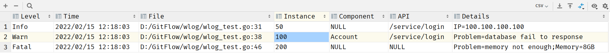

# Web Log

Package designed for web application, but not only for this purpose.

## History

At the beginning, it was designed to enhance the standard log package.

Therefore, it needs to be compatible with the standard log package.

But this principle make it hard to develop and use in web application.

Now, the package doesn't develop on the top of the standard log package.

Our new principle: **Structured**, **Analyzable**, **Stable**.

## Example

```go
package main

import (
	"net/http"

	"github.com/axli-personal/wlog"
	"os"
)

func main() {
	var logger wlog.Logger

	logger = wlog.NewLogger(os.Stdout, "||")
	logger = wlog.WithExtract(logger, "API")
	logger = wlog.WithExtract(logger, "Component")
	logger = wlog.WithExtract(logger, "Instance")
	logger = wlog.WithFlag(logger, wlog.Time|wlog.File)
	logger = wlog.WithMaxLevel(logger, wlog.Info, true)

	logger.MakeHeaders(nil)

	request, err := http.NewRequest("GET", "10.10.10.10", nil)

	logger.Log(wlog.Options{
		{"Level", wlog.Debug},
		{"RequestContent", request},
		{"RequestError", err},
	})

	logger.Log(wlog.Options{
		{"level", wlog.Info},
		{"Instance", 50},
		{"API", "/service/login"},
		{"IP", "100.100.100.100"},
	})

	logger.Log(wlog.Options{
		{"level", wlog.Warn},
		{"Instance", 100},
		{"API", "/service/login"},
		{"Component", "Account"},
		{"Problem", "database fail to response"},
	})

	logger.Log(wlog.Options{
		{"level", "Fatal"},
		{"Instance", 200},
		{"Problem", "memory not enough"},
		{"Memory", "8GB"},
	})
}
```

